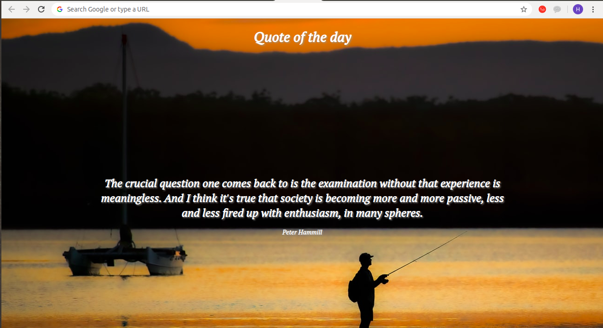

## **New tab quotes with Chrome Extension**

**What is Chrome Extension**

Google Chrome extension manager to turn on/off other extensions quickly and easily without leaving your current tab. 
Extensions are small software programs that customize the browsing experience. They enable users to tailor Chrome functionality 
and behavior to individual needs or preferences. They are built on web technologies such as HTML, JavaScript, and CSS.

**Installation steps**

    $ git clone https://github.com/hiralcmobio/chrome-extension.git

go to chrome browser and open `chrome://extensions/` and on Developer mode.

Click on `Load unpacked` button and open your chrome extension folder.

Now, just open new tab and it will show you Quote and author name with beautiful background.

 

You can have reference from here also https://developer.chrome.com/extensions

Happy Coding:)

